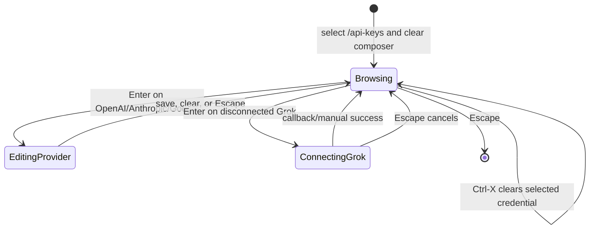

# TECH: TUI API-key management menu (CODE-1930)

Implements [`PRODUCT.md`](./PRODUCT.md) for [CODE-1930](https://linear.app/warpdotdev/issue/CODE-1930/tui-replace-byok-slash-commands-with-an-api-keys-inline-menu). Code references are pinned to `fd16dceb3f2a9e5e106f19010aa964265ac4f02c`.

## Context

The current TUI provider-key UX is split between public one-shot CLI flags, two slash commands that invoke those flags through the active PTY, and a separate in-process Grok card:

- [`crates/warp_tui/src/session.rs` (36-177) @ fd16dceb](https://github.com/warpdotdev/warp/blob/fd16dceb3f2a9e5e106f19010aa964265ac4f02c/crates/warp_tui/src/session.rs#L36-L177) defines `--set-provider-api-key` and `--clear-provider-api-key`, reads masked or piped input, writes through `ApiKeyManager::persist_provider_key`, and notifies live TUI processes.
- [`app/src/search/slash_command_menu/static_commands/commands.rs` (112-145) @ fd16dceb](https://github.com/warpdotdev/warp/blob/fd16dceb3f2a9e5e106f19010aa964265ac4f02c/app/src/search/slash_command_menu/static_commands/commands.rs#L112-L145) registers `/add-api-key` and `/clear-provider-api-key`.
- [`crates/warp_tui/src/terminal_session_view.rs` (3514-3607) @ fd16dceb](https://github.com/warpdotdev/warp/blob/fd16dceb3f2a9e5e106f19010aa964265ac4f02c/crates/warp_tui/src/terminal_session_view.rs#L3514-L3607) turns standard-provider slash commands into nested TUI shell commands, while Grok remains in-process.
- [`app/src/ai/tui_api_keys.rs` (1-46) @ fd16dceb](https://github.com/warpdotdev/warp/blob/fd16dceb3f2a9e5e106f19010aa964265ac4f02c/app/src/ai/tui_api_keys.rs#L1-L46) preserves coherence when a one-shot CLI process changes the TUI secure-storage namespace.

Credential ownership is already centralized:

- [`crates/ai/src/llm_provider.rs` (7-93) @ fd16dceb](https://github.com/warpdotdev/warp/blob/fd16dceb3f2a9e5e106f19010aa964265ac4f02c/crates/ai/src/llm_provider.rs#L7-L93) defines provider slugs, labels, and which providers accept pasted keys.
- [`crates/ai/src/api_keys.rs` (213-411) @ fd16dceb](https://github.com/warpdotdev/warp/blob/fd16dceb3f2a9e5e106f19010aa964265ac4f02c/crates/ai/src/api_keys.rs#L213-L411) owns in-memory credentials, secure-storage loading, durable pasted-key writes, Grok-token state, and change events.
- [`crates/ai/src/api_keys.rs` (540-655) @ fd16dceb](https://github.com/warpdotdev/warp/blob/fd16dceb3f2a9e5e106f19010aa964265ac4f02c/crates/ai/src/api_keys.rs#L540-L655) injects eligible pasted keys and Grok OAuth tokens into subsequent requests.

The TUI already has the required interaction primitives, but no secret mode:

- [`crates/warp_tui/src/conversation_menu.rs` (46-292) @ fd16dceb](https://github.com/warpdotdev/warp/blob/fd16dceb3f2a9e5e106f19010aa964265ac4f02c/crates/warp_tui/src/conversation_menu.rs#L46-L292) is the closest searchable menu lifecycle: it clears slash text, owns a live query, reconciles selection, and leaves acceptance-time work to its session.
- [`crates/warp_tui/src/inline_menu.rs` (35-343) @ fd16dceb](https://github.com/warpdotdev/warp/blob/fd16dceb3f2a9e5e106f19010aa964265ac4f02c/crates/warp_tui/src/inline_menu.rs#L35-L343) provides row snapshots, selection, scrolling, and mouse routing.
- [`crates/warp_tui/src/input/view.rs` (330-589) @ fd16dceb](https://github.com/warpdotdev/warp/blob/fd16dceb3f2a9e5e106f19010aa964265ac4f02c/crates/warp_tui/src/input/view.rs#L330-L589) owns the normal composer and already lets active inline menus reuse its editor buffer for query input.
- [`crates/warp_tui/src/editor_element.rs` (108-379) @ fd16dceb](https://github.com/warpdotdev/warp/blob/fd16dceb3f2a9e5e106f19010aa964265ac4f02c/crates/warp_tui/src/editor_element.rs#L108-L379) is the reusable char-cell editor element used by both the main input and generic TUI editor views, but it currently paints backing text verbatim.
- [`crates/warp_tui/src/editor_interaction.rs` (420-585) @ fd16dceb](https://github.com/warpdotdev/warp/blob/fd16dceb3f2a9e5e106f19010aa964265ac4f02c/crates/warp_tui/src/editor_interaction.rs#L420-L585) shows why masking alone is insufficient: keyboard Copy and Cut read the selected plaintext from `CodeEditorModel`.
- [`crates/warp_tui/src/slash_commands.rs` (299-342) @ fd16dceb](https://github.com/warpdotdev/warp/blob/fd16dceb3f2a9e5e106f19010aa964265ac4f02c/crates/warp_tui/src/slash_commands.rs#L299-L342) and [`crates/warp_tui/src/inline_menu.rs` (1232-1268) @ fd16dceb](https://github.com/warpdotdev/warp/blob/fd16dceb3f2a9e5e106f19010aa964265ac4f02c/crates/warp_tui/src/inline_menu.rs#L1232-L1268) provide the canonical NLD `(currently on|off)` state-suffix content and selected/unselected styling.

The existing Grok view combines protocol state with the card presentation that this change removes:

- [`crates/warp_tui/src/grok_oauth/mod.rs` (27-243) @ fd16dceb](https://github.com/warpdotdev/warp/blob/fd16dceb3f2a9e5e106f19010aa964265ac4f02c/crates/warp_tui/src/grok_oauth/mod.rs#L27-L243) owns browser launch, callback/manual-exchange arbitration, cancellation, retryable/fatal phases, and token storage.
- [`crates/warp_tui/src/grok_oauth/session.rs` (17-127) @ fd16dceb](https://github.com/warpdotdev/warp/blob/fd16dceb3f2a9e5e106f19010aa964265ac4f02c/crates/warp_tui/src/grok_oauth/session.rs#L17-L127) owns policy checks and installs the OAuth view as a blocking input source.

Warp credit fallback is already a shared typed setting and shared request input:

- [`app/src/settings/ai.rs` (1774-1787) @ fd16dceb](https://github.com/warpdotdev/warp/blob/fd16dceb3f2a9e5e106f19010aa964265ac4f02c/app/src/settings/ai.rs#L1774-L1787) defines `CanUseWarpCreditsForFallback`; only its surface metadata is GUI-only.
- [`app/src/ai/agent/api.rs` (288-304) @ fd16dceb](https://github.com/warpdotdev/warp/blob/fd16dceb3f2a9e5e106f19010aa964265ac4f02c/app/src/ai/agent/api.rs#L288-L304) reads it for requests shared by both frontends.

## Proposed changes

### Replace the slash-command surface without changing the CLI surface

Replace `SlashCommandKind::{AddApiKey, ClearApiKey}` and their two static commands with one exhaustive `SlashCommandKind::ApiKeys` and a TUI-only `/api-keys` command. Register it with the same AI-enabled availability as the existing commands.

`TuiTerminalSessionView::execute_tui_slash_command` opens the new interaction directly, clears the composer, and records one `/api-keys` acceptance event. Remove `ProviderApiKeyOperation`, `provider_api_key_shell_command`, and the standard-provider slash-to-PTY dispatch. These become dead after the old slash commands are removed.

Retain all one-shot infrastructure:

- `TuiArgs::{set_provider_api_key, clear_provider_api_key}`.
- `ProviderApiKeyCommand`, `read_provider_api_key`, and `warp::run_tui_cli_command`.
- `notify_tui_api_keys_changed`, `TuiApiKeyRefresher`, and the revision-file watcher.

Update only the Grok-specific CLI rejection text to direct users to `/api-keys`. This preserves external scripts and lets a live menu refresh when another TUI process uses a public flag.

### Add one stateful API-key inline-menu model

Add `crates/warp_tui/src/api_keys_menu.rs` with a `TuiApiKeysMenuModel` and an exhaustive interaction state:

- `Closed`.
- `Browsing`, with provider filter, `TuiInlineMenuListState`, and the selected row.
- `EditingProvider`, with one of the three pasted-key providers and optional persistence error.
- `ConnectingGrok`, with the existing OAuth subphase and optional sanitized error.

Like `TuiConversationMenuModel`, the model holds the normal input's `CodeEditorModel` handle. The same main `TuiInputView` remains focused and supplies:

- The provider filter in `Browsing`.
- The masked provider key in `EditingProvider`.
- The unmasked authorization code in `ConnectingGrok`.

Every transition clears or replaces that one buffer before changing state. No custom input view or secondary editor model is created, and the existing inline-menu/input layout remains the only bottom interaction surface.

Browsing reuses `TuiInlineMenuListState` for selection, scrolling, and mouse behavior. Build provider rows in alphabetical order—Anthropic, Google, OpenAI, X premium/SuperGrok—then append the fallback row after provider filtering. Subscribe to `ApiKeyManagerEvent::KeysUpdated` so in-process edits, Grok completion, and external-flag reloads update connected state without reopening the menu.

Implement `TuiInlineMenuHandle` for the model and add `ApiKeys` to the single authoritative `TuiInputSuggestionsMode`. Enter, Up, Down, Escape, mouse interaction, and buffer-change filtering continue through the shared inline-menu routing. Add a menu-scoped Ctrl-X input action, enabled by an API-key-menu context flag only when `Browsing` has a connected provider selected. Fixed bindings match the product's literal footer copy and do not need editable-binding lookup. Render footer spans from one state-derived descriptor so displayed hints and handled actions cannot diverge. Clearing refreshes the existing list in place so stable row identity preserves the selected provider while its status changes.

### Let the active inline menu control the main input's content policy

Extend the type-erased inline-menu interface with an input policy whose default preserves all existing menu behavior:

- `Composer`: existing behavior for current inline menus.
- `ManagedPlainText`: the menu owns the buffer, with ordinary rendering and clipboard behavior.
- `ManagedSecret`: the menu owns the buffer, with masked rendering and clipboard export disabled.

`TuiApiKeysMenuModel` reports `ManagedPlainText` while browsing or accepting a Grok code and `ManagedSecret` while editing a pasted provider key. `TuiInputView` derives the policy from its active inline menu rather than storing a second mutable “secret mode” flag. This makes the menu state the sole source of truth and prevents a failed transition from leaving the normal composer masked.

For both managed policies, `TuiInputView` bypasses prompt-only behavior: `!` cannot enter shell mode, `?` cannot open shortcuts, Up cannot open history, Tab cannot request shell completion, voice submission does not run, and Enter cannot emit a normal prompt submission. Character entry, paste, cursor movement, deletion, and selection continue through the shared editor model.

Extend `TuiEditorElement` with an explicit masked presentation used by `ManagedSecret`:

- Render one fixed-width mask glyph for every stored character while retaining the real value only in the existing input model.
- Keep cursor movement, deletion, paste, Select All, and selection painting functional against the backing value.
- Paint selection over mask glyphs so terminal-native selection can capture only the rendered mask.
- Make Copy and Cut no-ops in `TuiInputView` before `apply_editor_clipboard_action` can read the selected backing text.
- Keep copy-on-mouse-highlight disabled.

The menu preloads the connected provider's existing value from `ApiKeyManager::keys()` into the main input only after entering `EditingProvider`. It clears the input before every transition back to `Browsing`, on close, and when the menu is dropped. No error or telemetry path receives the key.

### Persist pasted keys in-process

On Enter in `EditingProvider`, read the main input buffer once and call `ApiKeyManager::persist_provider_key(provider, value, ctx)`, using `None` for an empty field.

Use `persist_provider_key`, not `set_provider_key`, because it writes secure storage before publishing `KeysUpdated` and returns failures to the UI. A failed write therefore leaves the manager's previous value authoritative and preserves the masked input for retry. A successful write clears the main input and returns to `Browsing`.

Ctrl-X in `Browsing` uses the same durable method with `None` for OpenAI, Anthropic, and Google. Clearing Grok continues through the existing Grok token setter so its token-storage and refresh lifecycle remain unchanged.

### Share the fallback setting definition, not its persisted value

Change `CanUseWarpCreditsForFallback.surface` from `SettingSurfaces::GUI` to `SettingSurfaces::ALL`. Do not add a new TUI setting, shared local store, cloud-sync exception, migration, or cross-process setting bus.

The existing settings-mode path selection continues to give GUI and TUI separate `settings.toml` values, matching other `ALL` settings. `TuiApiKeysMenuModel` reads `AISettings::can_use_warp_credits_for_fallback` and toggles it through the generated `ToggleableSetting::toggle_and_save_value` API.

Subscribe to the generated `AISettingsChangedEvent::CanUseWarpCreditsForFallback` while the interaction is open. This keeps the row current when the TUI-local settings file changes without introducing GUI/TUI value synchronization.

### Extract Grok OAuth state from the deleted card

Refactor `TuiGrokOAuthBlock` into a view-independent, TUI-private OAuth controller/model used by `TuiApiKeysMenuModel`. Preserve unchanged:

- `OauthAttempt::start`, browser launch, callback listener, PKCE/manual exchange, and cancellation handle.
- Attempt UUID checks and first-success-wins behavior.
- `Waiting`, `ExchangingManualCode`, and `Fatal` transitions.
- Retryable manual-code and fatal callback error copy.
- `ApiKeyManager::store_grok_tokens` and the existing deferred token persistence.
- Existing feature, workspace, organization, already-connected, input-ownership, and callback-bind gates.

Move code-editor ownership and all card rendering out of the OAuth controller. `ConnectingGrok` reads the main TUI input on Enter and maps controller events to the inline row, error, and footer presentation.

On callback success, clear the main input and transition to `Browsing`. On Escape or menu drop, cancel the current attempt, clear the input, and transition to `Browsing` or `Closed` as appropriate. Stale async completion remains guarded by attempt identity.

Delete the old Grok card rendering, `TuiGrokOAuthBlock` focus/keymap registration, `BlockingInputSource::GrokOAuth`, and transcript-card presentation branches after the menu controller owns all callers. Do not remove the provider-independent OAuth implementation under `crates/ai`.

### Add theme-derived API-key menu styles

Reuse `TuiInlineMenuRow::state_suffix` and the existing NLD selected/unselected suffix styles for `(Connected)`, `(Not connected)`, `(on)`, and `(off)`. Extend the generic row renderer only as needed to support a state suffix when a row has no description; do not add API-key-specific status colors.

Add semantic helpers to `TuiUiBuilder` only for the designed credential-entry border and connecting-row treatment. Derive them from active Warp theme and terminal colors; do not copy Figma hex values into TUI views.

The standard-key state renders only the provider title above the credential field. The Grok state keeps the provider/fallback list visible, marks the Grok row as connecting, and renders the code field below it. The main and nested states replace the generic status footer with their product-defined state-specific hints.

## End-to-end flow

## Testing and validation

Map tests directly to `PRODUCT.md` behavior:

- `app/src/search/slash_command_menu/static_commands/commands_tests.rs`: `/api-keys` is TUI-only; old provider-key slash commands are absent; the exhaustive kind registry remains valid (Behavior 1-3).
- `crates/warp_tui/src/session_tests.rs`: both public flags retain standard-provider parsing, set/clear behavior, masked/piped input contracts, and revised Grok guidance (Behavior 4-5).
- `crates/warp_tui/src/editor_element_tests.rs` and `crates/warp_tui/src/input/view_tests.rs`: managed secret input renders only mask glyphs in the normal input, retains editing and selection, blocks Copy/Cut from reaching a test clipboard, suppresses prompt-only input behavior, returns to normal plaintext behavior after dismissal, and never paints plaintext at narrow or wide widths (Behavior 27-30, 47-50).
- New `crates/warp_tui/src/api_keys_menu_tests.rs`: open/input clearing, provider order and connection labels, selection, pinned fallback filtering, zero provider matches, all footer variants, local setting toggle and persistence failure, preloaded masked keys, save/clear success, secure-storage failure rollback, cancellation, mouse activation, and live `KeysUpdated` refresh (Behavior 7-35, 47-50).
- Refactored `crates/warp_tui/src/grok_oauth/tests.rs`: browser-attempt start, empty/manual code, retryable and fatal failures, callback/manual race, stale-result suppression, success, Escape, drop cancellation, policy gates, already-connected behavior, and inline render snapshots (Behavior 36-46).
- `crates/warp_tui/src/terminal_session_view_tests.rs`: `/api-keys` opens in-process without PTY execution, shell history mutation, or conversation cancellation; closing restores the normal composer/footer; external revision reload updates an open menu (Behavior 2, 6, 9).
- Settings metadata tests assert `CanUseWarpCreditsForFallback` supports both surfaces while GUI and TUI settings modes still resolve separate values (Behavior 20-25).
- Render-to-lines tests cover main, filtered, fallback-selected, standard-key, Grok connecting, retryable-error, and fatal-error states under dark and light themes.

Run:

- Focused new and changed unit tests while iterating.
- `cargo nextest run -p warp_tui`.
- Focused `ai` and settings tests changed by the refactor.
- `./script/format`.
- The clippy invocation used by `./script/presubmit`.

Then run `./script/run-tui` in a real terminal and verify all three standard providers, external CLI-flag refresh, fallback persistence across a TUI restart, browser callback completion, manual Grok code entry, Escape cancellation, masked prefill, and clipboard blocking. Perform the Grok walkthrough only against the existing supported authorization environment; tests remain the deterministic coverage for failure/race states.

## Risks and mitigations

- **Secret disclosure through generic editor behavior:** Secret mode masks at paint time and blocks Copy/Cut before clipboard extraction. Focused tests assert that neither rendered cells nor the clipboard receive plaintext.
- **Credential loss after an apparent success:** Standard providers use write-before-publish persistence and remain in entry state on error.
- **Breaking external automation:** Public flags and their cross-process revision watcher remain intact; only slash-to-PTY dispatch is removed.
- **OAuth regressions during UI extraction:** Keep protocol state and attempt-identity logic unchanged and move only presentation/editor ownership.
- **Secret mode leaks into the normal composer:** Derive content policy from the active menu state rather than storing an independent flag, and clear the shared input on every state exit.
- **Managed input triggers prompt features:** Centralize prompt-feature suppression in `TuiInputView` for managed inline-menu policies and test every special prefix/action.
- **Settings architecture divergence:** Only broaden existing setting surface metadata; keep normal frontend-specific persistence and cloud-sync policy.
- **Theme regressions:** Add semantic builder helpers and render snapshots for light and dark themes rather than hard-coded colors.

## Parallelization

Parallel implementation is not recommended. The main-input content policy, API-key state machine, Grok controller extraction, and render-to-lines tests converge on the same inline-menu, input, and terminal-session boundaries; isolated branches would create more integration and conflict risk than wall-clock savings.
